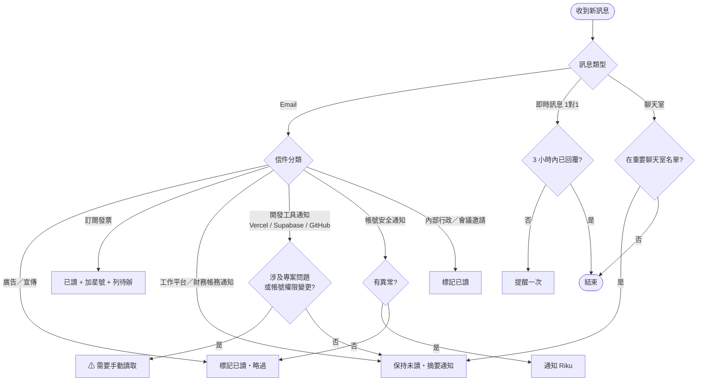

# 溝通 Agent 分類流程（規則 v1）

來源：`docs/AI原生分身系統_完整情境_複製至Cowork.md` 第二節「溝通 Agent 分類規則」。

```mermaid
flowchart TD
    IN([收到新訊息]) --> TYPE{訊息類型}

    TYPE -->|Email| MAIL{信件分類}
    TYPE -->|即時訊息 1對1| DM{3 小時內已回覆?}
    TYPE -->|聊天室| ROOM{在重要聊天室名單?}

    MAIL -->|廣告／宣傳| SKIP[標記已讀・略過]
    MAIL -->|訂閱發票| INVOICE[已讀 + 加星號 + 列待辦]
    MAIL -->|工作平台／財務帳務通知| SUMMARY[保持未讀・摘要通知]
    MAIL -->|開發工具通知<br/>Vercel / Supabase / GitHub| DEV{涉及專案問題<br/>或帳號權限變更?}
    MAIL -->|帳號安全通知| SEC{有異常?}
    MAIL -->|內部行政／會議邀請| READ[標記已讀]

    DEV -->|是| MANUAL[⚠ 需要手動讀取]
    DEV -->|否| SUMMARY

    SEC -->|是| ALERT[通知 Riku]
    SEC -->|否| SKIP

    DM -->|否| REMIND[提醒一次]
    DM -->|是| DONE([結束])

    ROOM -->|是| SUMMARY
    ROOM -->|否| DONE
```
